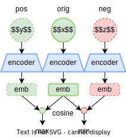

Specifics:
- task-oriented dialogues
- dialogue embedding

Method:
1. Obtain positive and negative augmentations
2. Get [CLS] hidden state as vector representation
3. Minimize contrastive loss:

$$\mathcal{L}=-\log{\exp(\cos(x,y))\over\sum_z\exp(\cos(x,z))
}$$